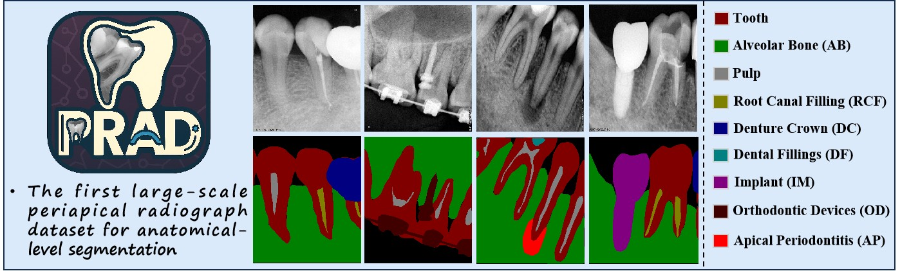
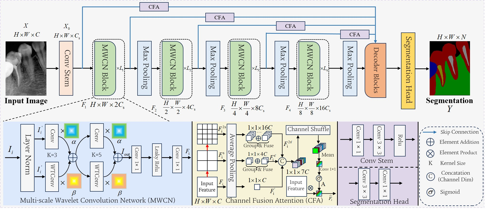
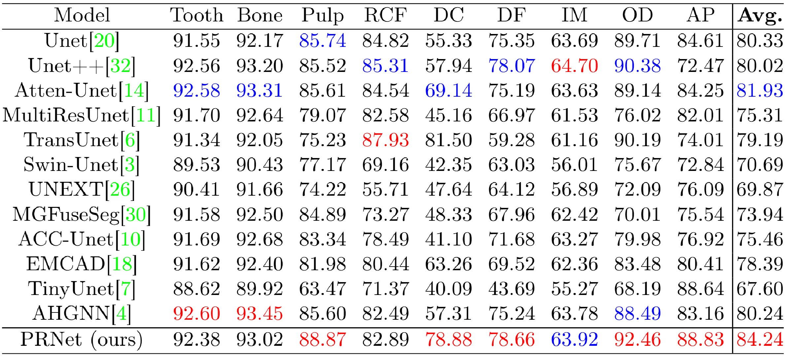

# Periapical Radiograph Analysis Dataset (PRAD) 🦷💻️🩻
[](https://creativecommons.org/licenses/by-nc/4.0/)
[](#-model)
[](#-PRAD-Dataset)

***PRAD**: Periapical Radiograph Analysis Dataset and Benchmark Model Development (MICCAI 2025 Poster)*
---
<div align="center">
  
</div>

## 📜 Table of contents：
- [Introduction](#-introduction)
- [News](#-news)
- [PRAD Dataset](#-prad-dataset)
- [Model](#-model)
- [Pending Work](#-Pending-Work)
- [Citation](#-citation)

---

## 📣 Introduction

<div align="center">
  
</div>

⭐️ **PRAD** is a large-scale periapical radiograph segmentation dataset, annotated and verified by two endodontists with over 10 years of clinical experience. It provides **nine anatomical-level segmentation labels**, including:
- Tooth
- Alveolar Bone (AB)
- Pulp
- Root Canal Filling (RCF)
- Denture Crown (DC)
- Dental Fillings (DF)
- Implant (IM)
- Orthodontic Devices (OD)
- Apical Periodontitis (AP)
  
⭐️ **PRAD** is designed to provide a **valuable supplement** to the dental deep learning community, addressing the data gap in periapical radiographs and **establishing benchmark models** to foster the thriving development of this field.

---

## 📣 News

- **[2025-09-21]** The codes of benchmark model PRNet has been released!
- **[2025-09-20]** The PRAD dataset is now officially open for public application. You are welcome to use it!
- **[2025-08-30]** All review and revision work for the PRAD dataset has been completed. Congratulations!
- **[2025-08-12]** Our logo of PRAD has been confirmed!
- **[2025-06-17]** Our paper has been accepted by MICCAI 2025 as a poster paper! See you in Daejeon!
- **[2025-04-10]** Our paper has been uploaded to [arXiv](https://arxiv.org/abs/2504.07760). 
- For any questions or you need help, please seed a email to `aics@nankai.edu.cn` or `zzh_nkcs@nail.nankai.edu.cn`
---

## 💾 PRAD Dataset

Due to copyright and commercial considerations, **the PRAD dataset will be partially available to the public through an application process**. If you wish to use the PRAD dataset, please follow the procedure below to submit the application form for our review and processing:
- Please download the application form [`PRAD_application.pdf`](./PRAD_application.pdf) from this repository, complete it with your basic information, affiliated institution, and the purpose of using PRAD, and provide an official seal or signature.
- Please compose an email with the subject line `PRAD-application+Name+Institution`, attach the completed application form, and send it to `aics@nankai.edu.cn`.
- Once you have sent the email, **your application will formally enter the review process**. We will process your request as soon as possible, **with an estimated completion time of 14 working days**, so please plan accordingly.
- Upon approval, we will reply to your email with a download link and usage instructions for the PRAD dataset. **You will then be granted access to `5,000` images and their corresponding segmentation labels from PRAD.**
---

## 🏁 Model
**PRNet** is a benchmark segmentation model specifically designed for the PRAD dataset task.

<div align="center">
  
</div>

<div align="center">
  
</div>

To use **PRNet**, locate the `class PRNet(nn.Module):` in the [`model.py`](./model.py) file of the repository, modify the model parameters as needed, and then easily integrate it into your training code for training and evaluation.

---

## 🗓️ Pending Work

- 🔲 MM-PRAD: A multimodal PRAD dataset with textual descriptions is currently under development. (Expected to be released later！)
- 🔲 Developed HyperPRNet to perform end-to-end segmentation and classification tasks on PRAD. (Coming soon!🔥🔥)
- 🔲 Release the multi-label classification annotations of PRAD. (Coming soon!🔥🔥)
- ✅ Release the codes of PRNet.
- ✅ Release the PRAD Dataset.
- ✅ Release the codes of PRNet.
- ✅ Fully review, modification and verification of the dataset again.

---

## 📌 Citation
If you find our work helpful, please cite us:  

```bibtex
@article{zhou2025prad,
  title={PRAD: Periapical Radiograph Analysis Dataset and Benchmark Model Development},
  author={Zhou, Zhenhuan and Zhang, Yuchen and Xu, Ruihong and Zhao, Xuansen and Li, Tao},
  journal={arXiv preprint arXiv:2504.07760},
  year={2025}
}
```
---
Copyright © College of Computer Science, Nankai University. All rights reserved.
